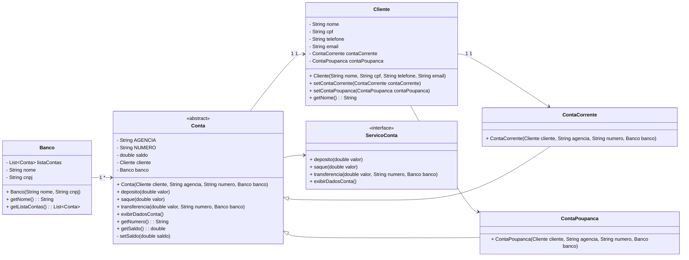

-Analysis of the book Software Engineering at Google Lessons Learned from Programming Over Time

-First activity:

We see three critical differences between programming and software engineering: time, scale, and the trade-offs at play. On a software engineering project, engineers need to be more concerned with the passage of time and the eventual need for change. In a software engineering organization, we need to be more concerned about scale and efficiency, both for the software we produce as well as for the organization that is producing it. Finally, as software engineers, we are asked to make more complex decisions with higher-stakes outcomes, often based on imprecise estimates of time and growth.

Reply: In my opinion, this piece of the text show the clean difference between programming and software engineering. The software engineering is more complex and more hard than only programming, because the enginning needed more hard skills and a broad view of the news projects. A software engineering needs too a much broader baggage of knowledge. 

Within Google, we sometimes say, “Software engineering is programming integrated over time.” Programming is certainly a significant part of software engineering: after all, programming is how you generate new software in the first place. If you accept this distinction, it also becomes clear that we might need to delineate between programming tasks (development) and software engineering tasks (development, modification, maintenance). The addition of time adds an important new dimension to programming. Cubes aren’t squares, distance isn’t velocity. Software engineering isn’t programming.

Replay: In this part of the text, we understand that engineering programming is more complex than programming alone. Engineering involves more utilities, requires more knowledge, patience, and careful planning of objectives."

-Three examples of non-functional requirements within a trade-off:

Reply: 

Performance x Segurança:
-Aumentar a segurança de um sistema pode, em muitos casos, impactar negativamente a performance. Por exemplo, criptografar dados em trânsito e em repouso adiciona uma camada de segurança, mas pode aumentar a latência e o tempo de processamento.

Escalabilidade x Custo:
-Projetar um sistema para ser altamente escalável, capaz de suportar grandes volumes de usuários e dados, geralmente requer investimentos significativos em infraestrutura, como servidores de alta capacidade ou serviços de nuvem. Isso pode aumentar consideravelmente os custos operacionais.

Usabilidade x Complexidade Funcional:
-Um sistema com funcionalidades complexas e avançadas pode se tornar difícil de usar para usuários finais, impactando negativamente a usabilidade. Simplificar a interface para torná-la mais amigável pode, por outro lado, limitar o acesso a funcionalidades avançadas que são necessárias para usuários mais experientes.

-Second Activity:

-Three examples of functional requirements within a trade-off:

Flexibilidade x Integridade dos Dados:

Permitir que os usuários finais tenham flexibilidade para personalizar relatórios e manipular dados pode ser um requisito funcional atraente, mas pode comprometer a integridade dos dados. Se os usuários tiverem liberdade excessiva para editar ou formatar dados, o risco de introduzir inconsistências ou erros aumenta.

Automação x Controle Manual:

A automação de processos, como o processamento de pedidos ou a geração de relatórios, pode aumentar a eficiência e a velocidade das operações. No entanto, isso pode reduzir o controle manual, o que é crucial em situações onde a intervenção humana é necessária para decisões críticas ou em casos onde o processo automatizado pode falhar.

Interoperabilidade x Personalização:

Um sistema que precisa ser interoperável com outras plataformas e sistemas corporativos pode exigir conformidade com padrões específicos que limitam a personalização. Por outro lado, permitir um alto grau de personalização pode dificultar a integração com outros sistemas, comprometendo a interoperabilidade.
 
 ---Third activity---
  
Independência de Implantação x Complexidade Operacional
Trade-off: Um dos maiores benefícios da arquitetura de microsserviços é a capacidade de implantar e escalar cada serviço de forma independente, permitindo que as equipes trabalhem de maneira autônoma e liberem atualizações sem impactar o sistema inteiro. No entanto, essa independência vem à custa de maior complexidade operacional. Monitorar, gerenciar e orquestrar dezenas ou até centenas de microsserviços pode ser desafiador, exigindo uma infraestrutura robusta, como Kubernetes, para gerenciamento de contêineres, e ferramentas avançadas de monitoramento e log.

Exemplo Real: Empresas como Netflix e Uber utilizam arquitetura de microsserviços para oferecer novos recursos de forma contínua. No entanto, para manter essa independência de implantação, ambas as empresas tiveram que investir significativamente em ferramentas de orquestração e monitoramento, como o uso do sistema Spinnaker (Netflix) para implantações contínuas, o que aumenta a complexidade operacional.

